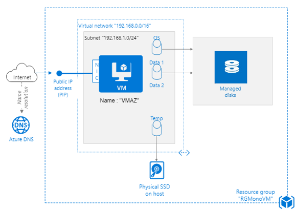
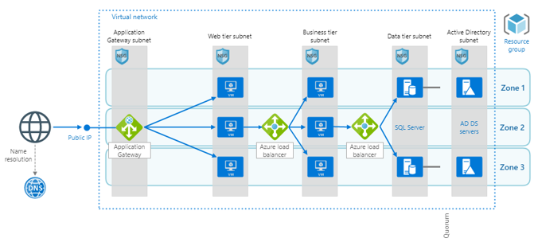
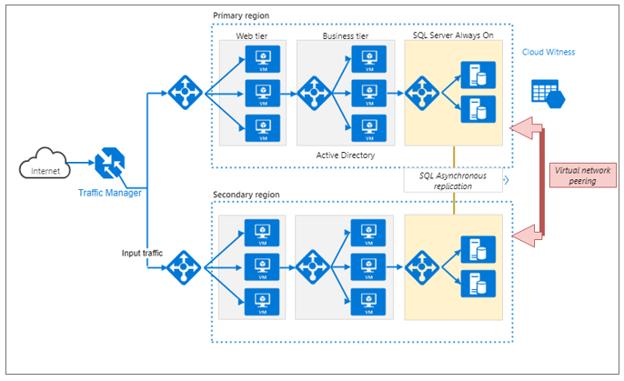

# TP DevOps &amp; Conteneurs : Terraform 
Charbonnel Damien 13/04/2020  V1.0 

# Partie 1 : Mise en place environnement de test

_**Partie sur 4 points.**_

1. Installer Visual Studio Code
2. Installer Graphviz (GVEDIT.exe) pour lire les fichiers de graphqiue Terraform
3. Installer Terraform sur votre poste de travail
4. Créer un compte Github gratuit
5. Créer un tenant de test Azure (limité à 30 jours mais avec cagnotte de 170 €):  
   [https://azure.microsoft.com/en-us/free/](https://azure.microsoft.com/en-us/free/)  
   **Conseil : créé vous une adresse de test GMAIL avant et utiliser la pour créer ce compte Azure, on pourra ainsi facilement regénérer un autre compte azure plus tard**

6. Créer un dossier de travail pour Terraform : l&#39;intégrer dans Visual Studio Code et GitHub afin de profiter du versionning
7. Créer la liaison entre votre tenant Azure et votre projet Terraform : **implémenter une authentification par Application Azure ou Service Principal**
8. Déployer une première architecture Terraform contenant :
    1. Un ressource Group nommé &quot;RGMonoVM&quot;
    2. Un réseau virtuel de classe &quot;192.168.0.0/16&quot;
    3. Un réseau virtuel de classe &quot;192.168.1.0/24&quot;
    4. Une machine virtuelle Windows nommé &quot;VMAZ&quot;
    5. Des disques managés (optionnel)

9. Rendre un dossier Zip Terraform correspondant au schéma ci-dessous :

# Partie 2 : Mise en place d&#39;une architecture cloud IAAS de production

Le but de cette partie est de rendre un dossier Terraform d&#39;une version simplifiée du schéma d&#39;architecture de meilleurs pratiques fournies par Microsoft.  _**Partie sur 8 points.**_

10. Les prérequis sont :
    1. Utiliser des variables dans le fichier de configuration
    2. Utiliser un fichier différent pour les variables Terraform
    3. Rendre le fichier graphique de l&#39;architecture (fichier généré par terraform)
    4. Les plans d&#39;adressages IPs sont libres
    5. Le Traffic manager, les load balancers et les Vms sont obligatoires
    6. Les noms des VMs sont libres mais doivent correspondent à la zone du schéma
    7. Les serveurs SQLs peuvent être modifiées par des VM nommées SQL\_XXX
    8. Les serveurs Azure ADDS peuvent être modifiées par des VM nommées ADDS\_XXX

11. Rendre un dossier Zip Terraform correspondant au schéma ci-dessous :

Se référer au schéma source original pour le descriptif des composants :

[https://docs.microsoft.com/en-us/azure/architecture/reference-architectures/n-tier/n-tier-sql-server](https://docs.microsoft.com/en-us/azure/architecture/reference-architectures/n-tier/n-tier-sql-server)

# Partie 3 : Mise en place d&#39;une architecture cloud IAAS de production redondée multi Geo

Le but de cette partie est de rendre un dossier Terraform d&#39;une version simplifiée du schéma d&#39;architecture de meilleurs pratiques fournies par Microsoft. _**Partie sur 8 points**_.

12. Les prérequis sont :

    1. Utiliser des variables dans le fichier de configuration
    2. Utiliser un fichier différent pour les variables Terraform
    3. Rendre le fichier graphique de l&#39;architecture (fichier généré par Terraform)
    4. Les plans d&#39;adressages IPs sont libres
    5. Les noms des VMs sont libres mais doivent correspondent à la zone du schéma
    6. Le Traffic manager, les load balancers et les Vms sont obligatoires
    7. Les serveurs SQLs peuvent être modifiées par des VM nommées SQL\_XXX
    8. Les serveurs Azure ADDS peuvent être modifiées par des VM nommées ADDS\_XXX
    9. La liaison de réplication SQL, le traffic de datacenter (virtual netwok Peering) et le partage témoin (Cloud Witness) ne sont pas nécessaires

13. Rendre un dossier Terraform correspondant au schéma ci-dessous :

Se référer au schéma source original pour le descriptif des composants :

[https://docs.microsoft.com/en-us/azure/architecture/reference-architectures/n-tier/multi-region-sql-server](https://docs.microsoft.com/en-us/azure/architecture/reference-architectures/n-tier/multi-region-sql-server)